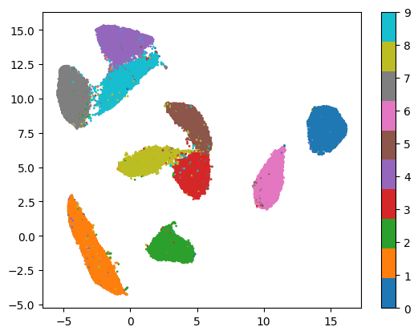
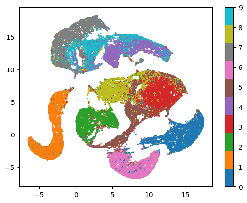
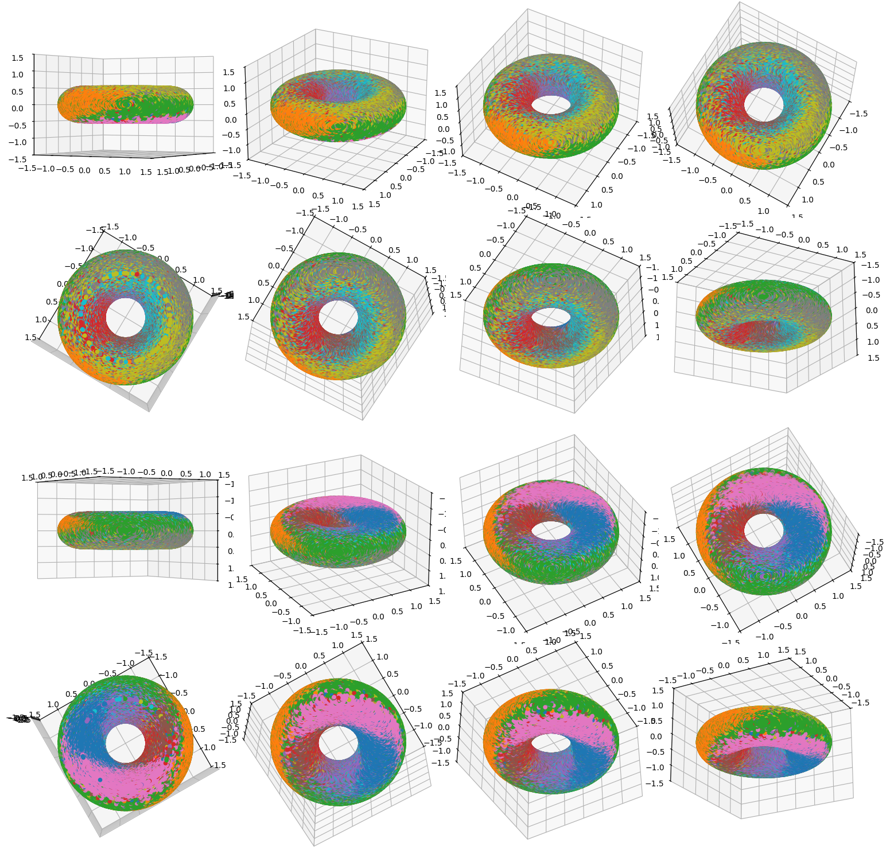

# Exploratory modelling on MNIST

This project contains resources and code for working with the MNIST dataset. We force a toroidal representation while attempting to maximize entropy for the dataset.

# UMAP (original)
- 

# UMAP (trained)
- 

# Toroidal Representation
- 
